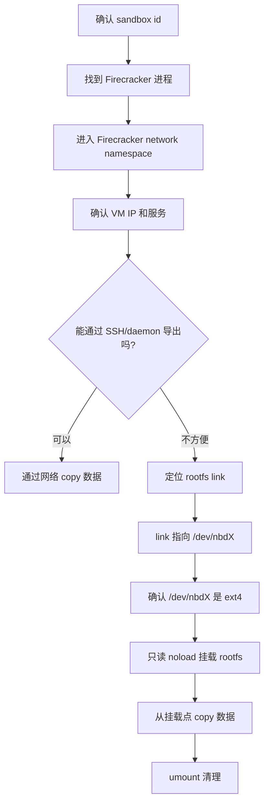

# Sandbox RootFS 数据恢复流程总结

## 结论

本次通过 Firecracker 进程定位到 sandbox 的 network namespace 和 rootfs NBD 设备，最终以只读方式挂载当前 rootfs，并从挂载点成功 copy 出数据。

关键点：

- `nsenter -n` 只能进入 Firecracker 的网络 namespace，不等于进入 VM shell。
- 如果 SSH/daemon 可用，可以走网络导出。
- 如果需要直接拿磁盘数据，可以找到当前 rootfs link 指向的 `/dev/nbdX`。
- 对运行中的 ext4 rootfs，挂载必须使用只读和 `noload`，避免回放 journal 或修改数据。

## 恢复流程图



## 本次关键命令

### 1. 找 Firecracker 进程

```bash
ps aux | grep i4wj6ywp3kihdujz03uz2
```

得到 Firecracker PID，例如：

```text
1767374 /fc-versions/v1.12.1_d990331/firecracker --api-sock /tmp/fc-i4wj6ywp3kihdujz03uz2-xxx.sock ...
```

### 2. 进入 network namespace 检查 VM 网络

```bash
sudo nsenter -t 1767374 -n ip addr
sudo nsenter -t 1767374 -n ip route
sudo nsenter -t 1767374 -n ip neigh
```

确认 guest VM IP：

```text
169.254.0.21 dev tap0 lladdr 02:fc:00:00:00:05 REACHABLE
```

### 3. 验证 VM 内服务

```bash
sudo nsenter -t 1767374 -n ping -c 2 169.254.0.21
sudo nsenter -t 1767374 -n curl -v --max-time 3 http://169.254.0.21:8081/health
```

返回：

```json
{"ok":true,"service":"Codesphere Daemon"}
```

说明可以从 Firecracker netns 访问 VM 内服务。

### 4. 定位 rootfs link

先从 Firecracker `--api-sock` 里拿 suffix，再拼 rootfs link：

```bash
export SBX=i4wj6ywp3kihdujz03uz2
export SUFFIX=rulmamrw5o0w6iqd7sx5
export ROOT_LINK="/orchestrator/sandbox/rootfs-${SBX}-${SUFFIX}.link"

ls -lah "$ROOT_LINK"
readlink -f "$ROOT_LINK"
```

本次结果：

```text
/orchestrator/sandbox/rootfs-i4wj6ywp3kihdujz03uz2-rulmamrw5o0w6iqd7sx5.link -> /dev/nbd64
```

### 5. 确认 NBD 设备类型

```bash
export DEV=/dev/nbd64
sudo file -s "$DEV"
```

结果：

```text
/dev/nbd64: Linux rev 1.0 ext4 filesystem data ... (needs journal recovery)
```

`needs journal recovery` 是运行中 ext4 的常见状态，所以后面必须只读挂载并禁止 journal 回放。

### 6. 只读挂载 rootfs

```bash
sudo mkdir -p "/mnt/live-${SBX}"
sudo mount -o ro,noload "$DEV" "/mnt/live-${SBX}"
```

验证：

```bash
sudo ls -lah "/mnt/live-${SBX}" | head
```

看到：

```text
bin -> usr/bin
boot
code
etc
home
```

说明 rootfs 挂载成功。

### 7. Copy 数据

按实际目录 copy，例如：

```bash
sudo rsync -aHAX --numeric-ids \
  "/mnt/live-${SBX}/code/" \
  "/tmp/recover-${SBX}/code/"
```

或 copy home：

```bash
sudo rsync -aHAX --numeric-ids \
  "/mnt/live-${SBX}/home/" \
  "/tmp/recover-${SBX}/home/"
```

### 8. 清理挂载

```bash
sudo umount "/mnt/live-${SBX}"
```
目标目录
```

## 注意事项

- 不要用普通读写 mount 挂载运行中的 rootfs。
- 对 ext4 使用：`mount -o ro,noload`。
- 不要随便 kill Firecracker，否则 rootfs link 可能被 orchestrator cleanup 删除，`/dev/nbdX` 会变成 empty。
- 如果 Firecracker 已退出，需要重新 resume sandbox，重新找到新的 `rootfs-<sandbox>-<suffix>.link`。
- copy 完后记得 `umount`。

## 心智模型

```text
Firecracker 进程
  -> 在独立 network namespace 里连接 guest VM
  -> rootfs 由 orchestrator 通过 NBD 暴露成 /dev/nbdX
  -> /orchestrator/sandbox/rootfs-<sandbox>-<suffix>.link 指向 /dev/nbdX
  -> 只读挂载 /dev/nbdX 后，可以像普通 Linux rootfs 一样 copy 文件
```
