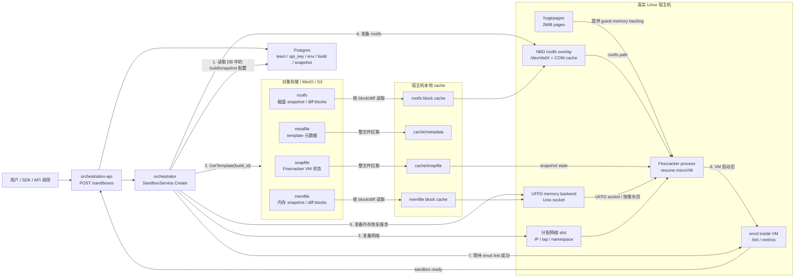
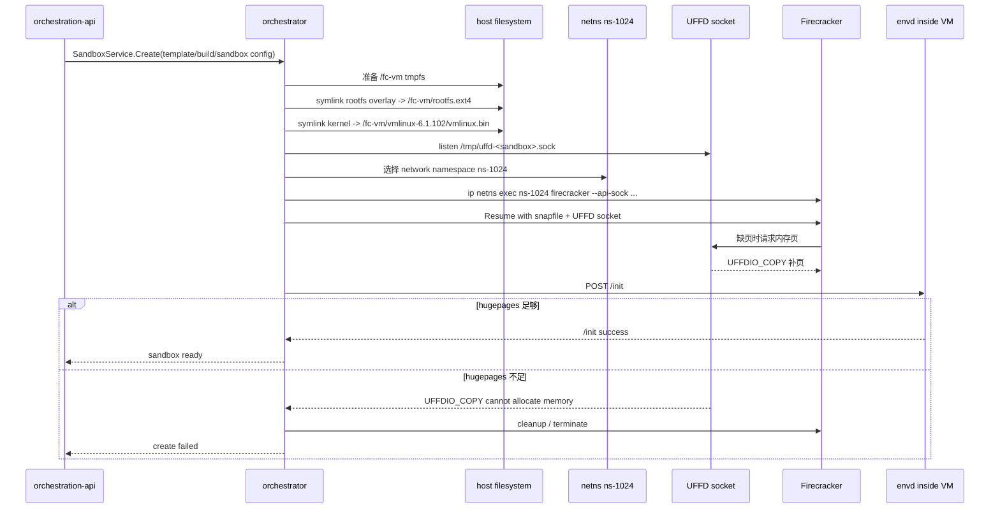
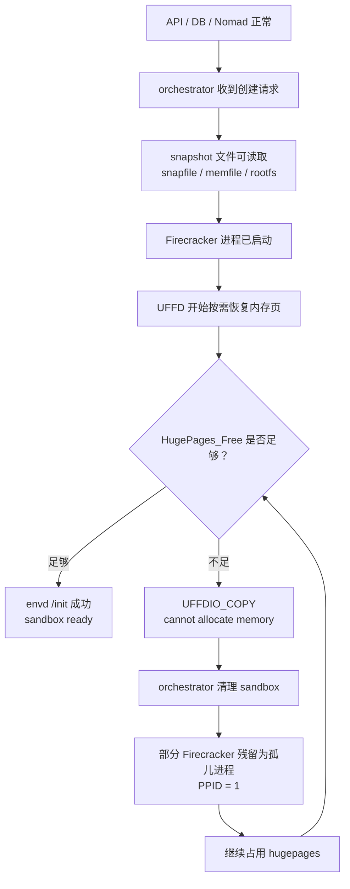

# AgentSphere Sandbox 创建失败问题总结

## 结论

本次 sandbox 创建失败的直接原因是：真实运行 Firecracker 的宿主机上存在多个残留的 Firecracker 进程，占用了大量 hugepages，导致新的 4GB hugepage sandbox 在 snapshot resume 阶段无法分配内存，最终触发：

```text
UFFD serve uffdio copy error: cannot allocate memory
failed handling uffd: failed uffdio copy cannot allocate memory
```

清理失败 sandbox 对应的残留 Firecracker 进程后，`HugePages_Free` 从 `857` 增加到 `8871`，问题恢复。

## 背景

- AgentSphere 的 sandbox 由 `orchestrator` 创建。
- 当前创建路径是 Firecracker snapshot resume。
- 失败 sandbox 配置中包含：

```text
sandbox_id: i4wj6ywp3kihdujz03uz2
ram_mb: 4096
huge_pages: true
snapshot: true
firecracker_version: v1.12.1_d990331
envd_version: 0.3.6
```

4GB hugepage sandbox 至少需要：

```text
4096MiB / 2MiB = 2048 hugepages
```

## Resume 链路图

这张图适合分享时先讲整体链路：API 不是直接启动一个全新的 VM，而是让 orchestrator 从已经构建好的 snapshot/template 里恢复一个 Firecracker microVM。



### Resume 步骤拆解

1. `api` 收到 `POST /sandboxes`，校验 `X-API-Key`，查 `team`、`env`、`env_build`、`snapshot`，确定要使用哪个 `template_id/build_id`。
2. `api` 通过 gRPC 调用 `orchestrator` 的 `SandboxService.Create`。
3. `orchestrator` 根据 `build_id` 调用 `templateCache.GetTemplate`，准备 snapshot 相关文件。
4. `snapfile` 和 `metafile` 会从对象存储拉到本地 cache；`memfile` 和 `rootfs` 通过 block/diff 方式按需读取。
5. `orchestrator` 准备宿主机资源：网络 slot、rootfs overlay、NBD 设备、UFFD memory backend。
6. `rootfs` 通过 NBD 暴露成 Firecracker 可用的磁盘路径，同时写入会落到 sandbox 自己的 COW cache。
7. `memfile` 由 UFFD 服务按需提供；Firecracker 访问缺页时，orchestrator 从 memfile 读对应 page，再通过 `UFFDIO_COPY` 填回 VM 内存。
8. Firecracker 使用 `snapfile + rootfs + UFFD socket + network` resume microVM。
9. VM 内的 `envd` 启动后，orchestrator 调用 `/init` 注入 env vars、token 等运行时配置。
10. `/init` 成功后，sandbox 进入 ready/running 状态。

### 从日志还原一次 Resume

下面这段日志用来讲 resume 的真实执行顺序。

```text
03:27:09.371 create sandbox config
03:27:09.423 create_process function log
03:27:09.423 starting firecracker resume
03:27:09.535 failed to do request to envd, retrying
03:27:26.xxx UFFDIO_COPY cannot allocate memory
```

对应关系：

| 日志 | 说明 | 心智模型 |
|---|---|---|
| `create sandbox config` | API 已经把 sandbox 参数传给 orchestrator | 业务层已经完成调度和参数组装 |
| `template_id / build_id / snapshot:true` | 这次不是普通冷启动，而是按 build snapshot 恢复 | 后续会找 `snapfile/memfile/rootfs` |
| `huge_pages:true / ram_mb:4096` | 这个 sandbox 需要 hugepages 承载 guest memory | 至少需要约 `2048` 个 2MiB hugepages |
| `create_process function log` | orchestrator 生成 Firecracker 启动脚本 | 准备宿主机运行环境 |
| `mount -t tmpfs tmpfs /fc-vm` | 创建 Firecracker 运行时临时目录 | `/fc-vm` 是本次 VM 的运行现场 |
| `ln -s ...rootfs... /fc-vm/rootfs.ext4` | 把 NBD/rootfs overlay 链接给 Firecracker | Firecracker 看到的是一个 rootfs 文件路径 |
| `ln -s ...vmlinux.bin` | 把指定 kernel 链接到 VM 目录 | kernel 版本必须和 snapshot 兼容 |
| `ip netns exec ns-1024 ... firecracker` | Firecracker 在指定 network namespace 中启动 | VM 网络隔离在 netns 里 |
| `starting firecracker resume` | 开始调用 Firecracker resume | 已经拿到 `uffd_socket` 和 `snapfile` |
| `uffd_socket=/tmp/uffd-...sock` | Firecracker 缺页时通过这个 socket 连接 orchestrator | UFFD 是内存恢复通道 |
| `snapfile=/orchestrator/template/.../snapfile` | Firecracker 使用这个 snapshot 状态文件恢复 VM | 这是 VM pause 时保存的设备/CPU 状态 |
| `failed to do request to envd /init` | VM 内的 envd 还没准备好或 VM 已经卡住 | 这里是症状，不一定是根因 |

把这段日志翻译成流程就是：



关键点：`failed to do request to envd` 出现得比较早，但它不是最强根因证据。真正的根因证据是后面的 `UFFDIO_COPY cannot allocate memory`，因为那说明 Firecracker resume 过程中内存页恢复失败了。

## 本次故障位置图

本次问题发生在第 7 步：UFFD 给 Firecracker 补内存页时，需要给 4GB hugepage VM 分配足够的 2MiB hugepages，但宿主机的 free hugepages 不够。



### 本次数据如何证明

```text
清理前:
HugePages_Free = 857
857 * 2MiB ≈ 1.67GiB

目标 sandbox:
ram_mb = 4096
huge_pages = true
需要约 2048 个 hugepages

结果:
857 < 2048
所以 4GB hugepage VM resume 时无法完成内存补页
```

清理失败 sandbox 的残留 Firecracker 后：

```text
HugePages_Free: 857 -> 8871
释放: 8014 * 2MiB ≈ 15.6GiB
```

这说明残留 Firecracker 进程确实占用了 hugepages，是本次问题的关键证据。

## 现象

创建 sandbox 时，orchestrator 日志中出现：

```text
failed to do request to envd, retrying
Post "http://10.11.4.0:49983/init": context deadline exceeded
```

随后出现关键错误：

```text
UFFD serve uffdio copy error  error="cannot allocate memory"
failed to wait for sandbox, cleaning up
error="failed handling uffd: failed to handle uffd: failed uffdio copy cannot allocate memory"
```

之后该 sandbox 被清理，后续访问出现：

```text
sandbox not found
```

这些 `sandbox not found` 是后续副作用，不是根因。

## 排查过程

### 1. 确认真正运行机器

SSH 到真实 sandbox 宿主机。

### 2. 检查 orchestrator 限制

在真实宿主机上确认：

```text
Max locked memory: unlimited
Max memory size: unlimited
Max address space: unlimited
```

Nomad cgroup 也没有内存上限：

```text
memory.max = max
oom = 0
oom_kill = 0
```

所以问题不是 ulimit，也不是 Nomad cgroup 内存限制。

### 3. 检查 Firecracker 进程

发现宿主机上有大量 Firecracker 进程：

```bash
pgrep -af firecracker | wc -l
# 51
```

并且失败 sandbox `i4wj6ywp3kihdujz03uz2` 自身就残留了 7 个 Firecracker 进程：

```text
fc-i4wj6ywp3kihdujz03uz2-...
fc-i4wj6ywp3kihdujz03uz2-...
fc-i4wj6ywp3kihdujz03uz2-...
```

这说明失败的 sandbox 没有被完全清理。

### 4. 检查 hugepages

清理前：

```text
HugePages_Total: 51583
HugePages_Free:    857
Hugepagesize:     2048 kB
```

`857 * 2MiB = 1714MiB`，不足以启动一个 4GB hugepage sandbox。

清理失败 sandbox 后：

```text
HugePages_Free: 8871
```

释放量：

```text
8871 - 857 = 8014 hugepages
8014 * 2MiB ≈ 15.6GiB
```

这证明残留 Firecracker 进程确实占用了大量 hugepages。

## 根因

```text
sandbox resume 失败
  -> Firecracker 进程没有被完全清理
  -> 残留 Firecracker 持续占用 hugepages
  -> HugePages_Free 下降到不足以创建新的 4GB sandbox
  -> 新 sandbox 在 UFFD 恢复内存页时分配失败
  -> 出现 cannot allocate memory
```

核心不是：

- API key 问题
- DB migration 问题
- Nomad cgroup 限制
- ulimit 限制
- Docker registry 问题

核心是：

- Firecracker 残留进程
- hugepages 被占用
- UFFD snapshot resume 无法继续分配内存

## 修复动作

只清理确认已经失败的 sandbox 对应 Firecracker 进程：

```bash
sudo pkill -f 'fc-i4wj6ywp3kihdujz03uz2'
```

验证清理结果：

```bash
pgrep -af 'fc-i4wj6ywp3kihdujz03uz2' || true
grep -i huge /proc/meminfo
free -h
```

清理后 hugepages 恢复，sandbox 创建问题解决。

## 常用诊断命令

### 查看内存和 hugepages

```bash
free -h
grep -i huge /proc/meminfo
```

### 查看 Firecracker 数量

```bash
pgrep -af firecracker | wc -l
pgrep -af firecracker | sed -n '1,80p'
```

### 按 sandbox id 查残留 Firecracker

```bash
pgrep -af 'fc-<sandbox_id>' || true
```

### 查看某个 Firecracker 日志

```bash
ls -lah /var/log/firecracker-<sandbox_id>.log
tail -120 /var/log/firecracker-<sandbox_id>.log
```

### 查看 orchestrator 限制

```bash
pid=$(pidof orchestrator | awk '{print $1}')
cat /proc/$pid/limits
cat /proc/$pid/cgroup
```

### 查看 Nomad cgroup 内存限制

```bash
systemctl cat nomad | sed -n '1,160p'
cat /sys/fs/cgroup/system.slice/nomad.service/memory.max 2>/dev/null || true
cat /sys/fs/cgroup/system.slice/nomad.service/memory.current 2>/dev/null || true
cat /sys/fs/cgroup/system.slice/nomad.service/memory.events 2>/dev/null || true
```

### 查看内核错误

```bash
sudo dmesg | grep -Ei 'oom|killed|uffd|userfault|firecracker|cannot allocate|huge|memory' | tail -120
```

## 后续建议

### 1. 加入孤儿 Firecracker 检查

自动化部署或运维脚本中应加入检查：

```bash
pgrep -af firecracker | wc -l
```

并按 sandbox id 聚合：

```bash
pgrep -af firecracker \
  | sed -E 's/.*fc-([a-z0-9]+)-.*/\1/' \
  | sort \
  | uniq -c \
  | sort -nr
```

### 2. 创建前检查 hugepages 是否足够

对于 4GB hugepage sandbox，至少需要约 `2048` 个 free hugepages。建议创建前检查：

```bash
grep -E 'HugePages_Free|Hugepagesize' /proc/meminfo
```

### 3. 谨慎清理

不要直接全量 `pkill firecracker`，因为可能误杀正常运行的 sandbox。应该先确认 sandbox 已经在 API/orchestrator 中不存在，再按 sandbox id 精准清理：

```bash
sudo pkill -f 'fc-<sandbox_id>'
```

### 4. 关注 orchestrator 清理逻辑

后续需要继续调查为什么失败 sandbox 的 Firecracker 没有被完全清理。重点关注：

- Firecracker 进程是否被 double-fork 或变成 PPID 1
- orchestrator cleanup 是否只清理了部分进程
- 同一个 sandbox id 多次 resume 是否复用了同一个 log path
- UFFD 失败后 cleanup 是否覆盖所有 Firecracker pid

## 心智模型

```text
AgentSphere sandbox 创建
  -> API 接收创建请求
  -> orchestrator 选择模板和 snapshot
  -> Firecracker 启动 microVM
  -> UFFD 按需恢复 snapshot 内存页
  -> envd 在 VM 内启动并响应 /init
  -> sandbox 进入可用状态
```

本次失败发生在：

```text
Firecracker 已启动
  -> UFFD 恢复内存页
  -> hugepages 不足
  -> uffdio copy cannot allocate memory
  -> Firecracker 被终止/残留
  -> sandbox 创建失败
```

## 最终状态

- 失败 sandbox 的残留 Firecracker 已清理。
- `HugePages_Free` 明显恢复。
- sandbox 创建链路恢复正常。
